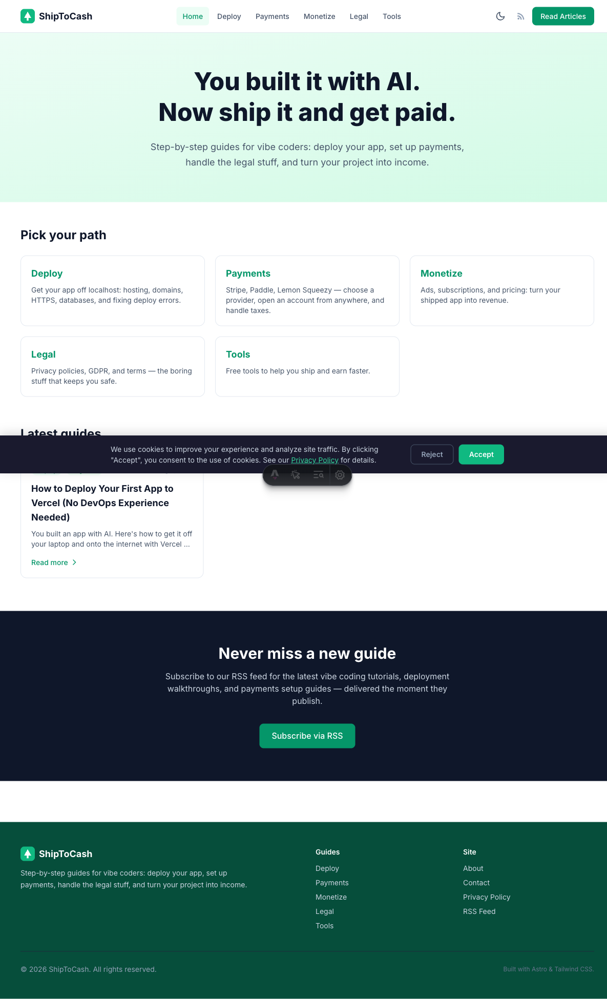

# ShipToCash

**You built it with AI. Now ship it and get paid.**

Step-by-step guides for vibe coders: deploy your app, set up payments, handle the legal stuff, and turn your project into income.

🌐 **Live site: [shiptocash.com](https://shiptocash.com)**



## What's inside

- **Deploy** — hosting, custom domains, HTTPS, databases, and fixing deploy errors
- **Payments** — Stripe, Paddle, Lemon Squeezy, merchant of record, taxes
- **Monetize** — ads, subscriptions, and pricing
- **Legal** — privacy policies, GDPR, and terms
- **Tools** — free utilities to help you ship and earn faster

Every guide is labeled by difficulty (Beginner / Intermediate) and tested against the current version of the tools it covers.

## Tech stack

- [Astro](https://astro.build) + MDX + Tailwind CSS 4 — static, fast, SEO-friendly
- Dark mode, RSS feed, sitemap, per-post OG images, FAQ structured data (JSON-LD), table of contents
- Deployed on Cloudflare Workers (static assets), auto-built on every push to `main`

## Develop

```bash
npm install
npm run dev        # local dev server
npm run build      # production build → dist/
```

## Writing a new guide

1. Add a Markdown file to `src/content/blog/` with frontmatter (`title`, `description`, `pubDate`, `category`, `difficulty`, optional `faq`)
2. Generate OG images: `node scripts/generate-og-images.mjs`
3. `npm run build` to verify, then commit and push — Cloudflare Pages deploys automatically

Content roadmap lives in `docs/cluster-1-deploy-topics.md`.
